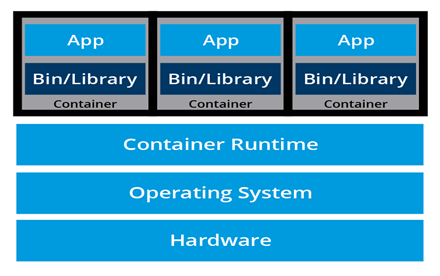

#
# Virtualization

###  Layers for Systems :
-  1. hardware 2.<--- Host O.S <---3.  <---Software <-- V.M. <--- Guest O.S

- To use the virtualization wee need to use the Guest OS on the top of the HOST OS 
- But for the Guest OS , We provide V.M.(Hypervisor) concept as hardware which act like hardware 

-  You can save the running image of the os as snapshots , and can be used for further usages

- We can install the multiple apps on the one server , but need the isolation b/w thems , there we can run the multiple os on the hypervisor then the apps 

# Containerization 

-   On hypervisor we need the multiple guest  os for the different apps  , and we give the entire os image for further usages which will be heavy 
- to solve this problem we need to use the conainter 

#### The  different Conatainer runs on the same OS ,  
-one container is running on the on os to scale you can run the same container on the multiple instances 

