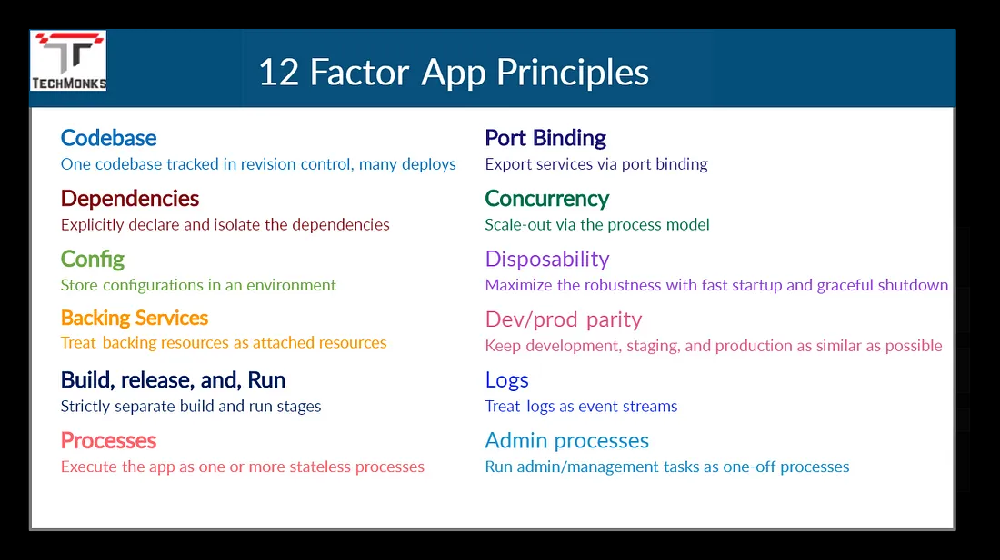

# Microservice :

```
Microservices-based architecture is aligned with Event-driven Architecture and Service-Oriented Architecture (SOA) principles, where complex applications are composed of small independent processes which communicate with each other through Application Programming Interfaces (APIs) over a network. APIs allow access by other internal services of the same application or external, third-party services and applications.

```

# Scalability Microservices 

#### Scaling the Particular service like payments and searches 


- In this the different services can be build in different languages , which can be self containet and 
deployed independently 

- Scale base on the requirement 
- if one service is unableable the other  web service is running 
- Designing the Microservices properly is important things 

# Cloud Native 

##  Cloud Ready vs Cloud Native

# 12- Factor APP
#### [Article](https://medium.com/techmonks/12-factor-app-principles-and-cloud-native-microservices-a383f6abc97f)




# MicroServices  Project APPs 

- ### [Project 1]()

- ### [Project 1]()

- ### [Project 1]()

- ### [Project 1]()

- ### [Project 1]()

- ### [Project 1]()

```markdown


Java Questions:
What is the access modifier that allows the most access in Java?

Options: public, private, protected, static

Answer: public

Which of the following is a key concept in object-oriented programming?

Options: Inheritance, Encapsulation, Polymorphism, Abstraction

Answer: Inheritance

Which data structure is part of the Java Collections Framework and allows dynamic array resizing?

Options: Array, ArrayList, LinkedList, HashMap

Answer: ArrayList

Python Questions:
Which function is used to print output in Python?

Options: print(), echo(), write(), read()

Answer: print()

Which data type is used to store key-value pairs in Python?

Options: dictionary, tuple, set, list

Answer: dictionary

What is the method used for initializing an object in a class in Python?

Options: init, main, name, dict

Answer: init

SQL Questions:
Which SQL command is used to retrieve data from a database?

Options: SELECT, INSERT, UPDATE, DELETE

Answer: SELECT

Which data type in SQL is used to store text strings?

Options: VARCHAR, INTEGER, BOOLEAN, DATE

Answer: VARCHAR

Which SQL clause is used to combine rows from two or more tables based on a related column?

Options: JOIN, UNION, INTERSECT, EXCEPT

Answer: JOIN

General Question:
What is the boolean value for true?

Options: True, False, Maybe, None of the above

Answer: True

```