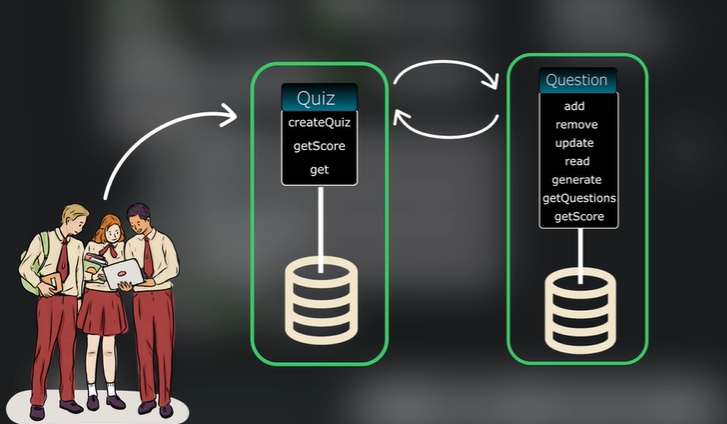
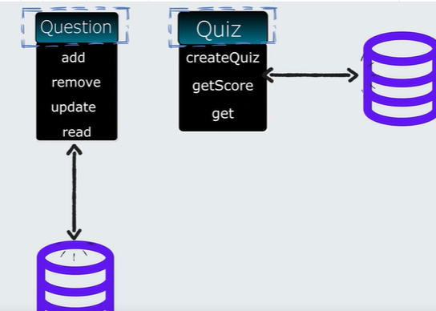
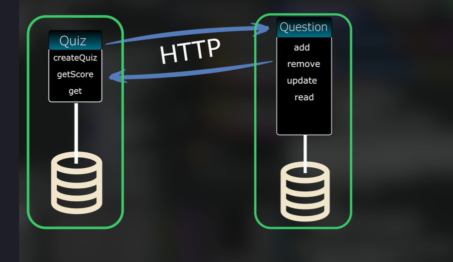
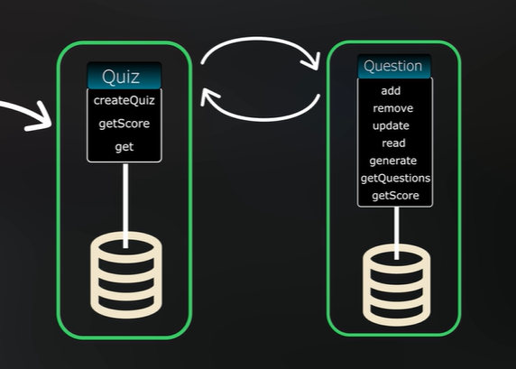
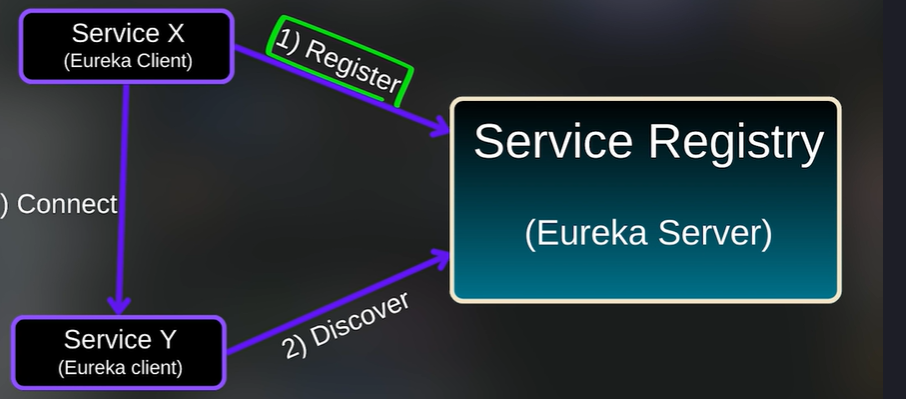

#
# MicroServices 

### [Intro to MicroServices](/Microservices/MicroservicesIntro.md)

### [Monolithic Example of Application](/Microservices/SpringQuizApp1)

### [Microservice Applications](/Microservices/)

-   #### 1. [Question Service](/Microservices/question-service/)

-   #### 2. [Quiz Microservice](/Microservices//question-service/)


## Running the Apps with the multiple Instance 
```markdown
- Go to edit config 
- COpy config 
- Modify Vm Options 
Write down below config: 

- Dserver.port=8081

# Quiz Service and Question Service Working as Microservice: 


```
### Making the Different Services for Quiz and Question DB

  
- when we have different services loosely coupled we can scale them individually 
- Making the Registry for different service like Quiz and Question to communicate each other 
- need to add the failed pass if some service is not responding 
- 







# Discovery of the services by Eureka Client



# Creating Service Registry

-   ### Create the project for service Registery
  - web spring 
  - Eureak server
  - Every service will regisgter to the eureka service 
  - In main 
  @EnableEurekaService

  # add the application-properties 
  -name
  -server
  -eureak host
  -eureak registry discovery

  # Working With Feign 

  - It will handle all the Rest api endpoint url
  #### Create the Feign Interface 
  ```java
  @FeignClient("QUESTION-SERVICE")
  public interface QuizInterface{
    // declare the method to use 
  }
```
- Autowire the QuizInterface in QuizService 
